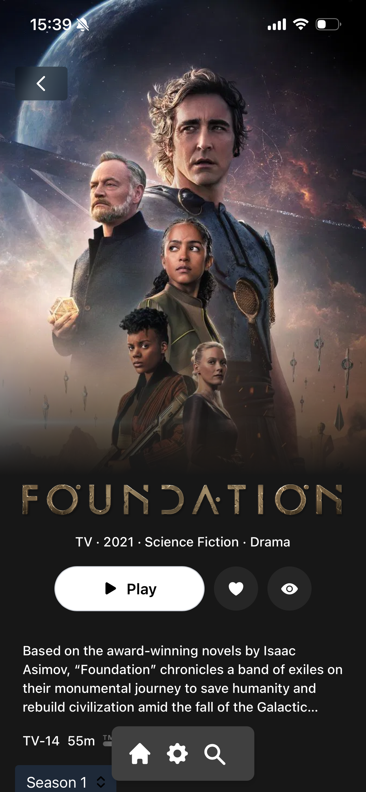

   

   

  <h1><b>Remux</b></h1>
  
<i>A *VERY experimental* web/desktop client for Jellyfin written in Rust </i>

Mobile Layout 

  
  

Desktop Layout 
 

  

Hosted version at: https://app.remux.media

The hosted version only works for Jellyfin servers that are behind a reverse proxy and have HTTPS set up correctly. If your server runs over HTTP, you must host it yourself.

### Catalogs

The home screen is heavily reliant on collections. 
So i suggest using some jellyfin plugins to create some cool ones.

You can manage the home screen from the settings.

### Why another client?

For fun and learning Rust. And ofcourse the usual delusions of "i can do it better".

What makes this different.

- A more family orientated client. Most users just want that netflix experience.
- Multiple providers support. It has a pluggable source system. So while only jellyfin is currently supported im also planning support for stremio
- central management of settings for all users
- tons of options to customize the home screen

### Selfhosting
 
Theres a docker image avaiable at: ghcr.io/lostb1t/remux:latest

Experimental native builds can be found here: https://github.com/lostb1t/remux/releases/tag/nightly

### Development

Make sure you have installed [Rust](https://www.rust-lang.org/tools/install)

1. Install the Tailwind CSS CLI: https://tailwindcss.com/docs/installation/tailwind-cli
2. Install rust dependencies: `cargo install cargo-make dioxus-cli`
3. run dev: `cargo make dev`
