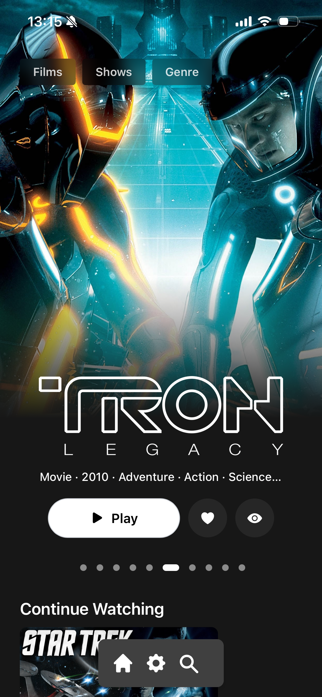

   

   

  <h1><b>Remux</b></h1>
  
<i>An *experimental* web client for Jellyfin written in Rust </i>

 Mobile Layout 

  

 Desktop Layout 

  

### Development

1. Install npm: https://docs.npmjs.com/downloading-and-installing-node-js-and-npm
2. Install the Tailwind CSS CLI: https://tailwindcss.com/docs/installation
3. Install cargo make: `cargo install --force cargo-make`
4. run dev: `cargo make dev`

### Docker
 
Theres a docker image avaiable at: ghcr.io/lostb1t/remux:latest